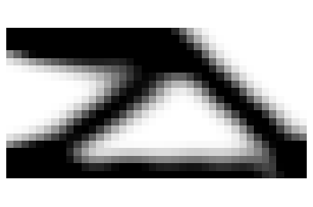

# PINNTO

A Python Code for "A physics-informed neural network-based topology optimization (PINNTO) framework for structural optimization"



<p align="center">
  
</p>

## Developer
[Google Scholar] https://scholar.google.com.au/citations?user=0mMGH1wAAAAJ&hl=en

[Github] https://github.com/gyrn297

## Citation
If you use this code for your research please cite:

```
@article{JEONG2023115484,
    title = {A Physics-Informed Neural Network-based Topology Optimization (PINNTO) framework for structural optimization},
    journal = {Engineering Structures},
    volume = {278},
    pages = {115484},
    year = {2023},
    issn = {0141-0296},
    doi = {https://doi.org/10.1016/j.engstruct.2022.115484},
    url = {https://www.sciencedirect.com/science/article/pii/S0141029622015607},
    author = {Hyogu Jeong and Jinshuai Bai and C.P. Batuwatta-Gamage and Charith Rathnayaka and Ying Zhou and YuanTong Gu},
    keywords = {Topology optimization, Physics informed neural network, Machine learning, Solid mechanics},
    abstract = {Physics-Informed Neural Networks (PINNs) have recently attracted exponentially increasing attention in the field of computational mechanics. This paper proposes a novel topology optimization framework: Physics-Informed Neural Network-based Topology Optimization (PINNTO). Unlike existing machine-learning based topology optimization frameworks, PINNTO employs an energy-based PINN to replace Finite Element Analysis (FEA) in the conventional structural topology optimization, to numerically determine the deformation states, which is a key novelty in the proposed methodology. A supervised neural network that respects governing physical laws defined via partial differential equations is trained to develop the corresponding network without any labelled data, with the intention of solving solid mechanics problems. To assess feasibility and potential of the proposed PINNTO framework, a number of topology-optimization-related case studies have been implemented. The subsequent findings illustrate that PINNTO has the ability to attain optimized topologies with neither labelled data nor FEA. In addition, it has the capability to generate comparable designs to those produced by the current successful approaches such as Solid Isotropic Material with Penalization (SIMP). Based on the results of this study, it can also be deduced that PINNTO can acquire optimal topologies for various types of complex domains given that the boundary conditions and loading configurations are correctly imposed for the associated energy-based PINN. Consequently, the proposed PINNTO framework has demonstrated promising capabilities to solve problems under conditions when the usage of FEA is challenged (if not impossible). In summary, the proposed PINNTO framework opens up a new avenue for structural design in this ‘data-rich’ age.}
}
```
